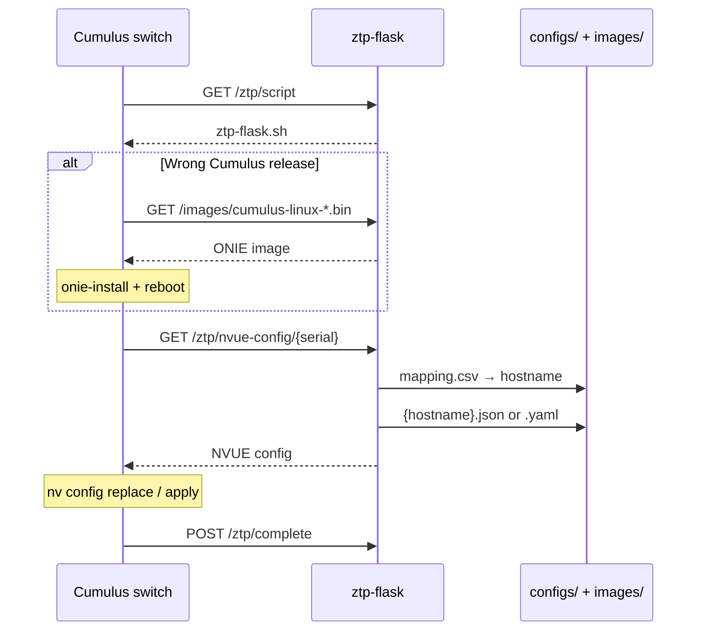

# ztp-flask

HTTP proxy for **Zero Touch Provisioning (ZTP)** of NVIDIA Cumulus Linux switches. Devices run an autoprovisioning script that fetches a system image (when needed), resolves their serial number to a hostname, downloads the matching **NVUE** config (JSON or YAML), and applies it with `nv config replace` / `nv config apply`.

The proxy does not call NetBox or other backends at request time; hostname lookup uses a local **`mapping.csv`** and config files are served from disk.

## How it works



1. The switch downloads `ztp-flask.sh` from `/ztp/script` (or via ONIE `-z` after image install).
2. If the running Cumulus release does not match the target in the script, it reinstalls from `/images/<filename>.bin` and reboots.
3. The script reads the device serial, calls `/ztp/nvue-config/<serial>`, and applies the returned config.
4. On success it notifies `/ztp/complete` (optional logging/audit) and reboots.

## API

| Method | Path | Auth | Description |
|--------|------|------|-------------|
| `GET` | `/health` | — | Liveness check (`{"status":"ok"}`). |
| `GET` | `/ztp/script` | — | Autoprovisioning shell script (`text/x-shellscript`). |
| `GET` | `/images/<filename>` | — | ONIE/Cumulus image (basename only; path traversal rejected). |
| `GET` | `/ztp/nvue-config/<serial>` | Optional | Resolve serial → hostname via `mapping.csv`, return `{hostname}.json` or `{hostname}.yaml`. |
| `POST` | `/ztp/complete` | Optional | JSON body: `{"serial":"...","hostname":"..."}` — logs successful ZTP. |

When `ZTP_PROXY_API_KEY` is set on the server, protected routes require header:

```http
X-ZTP-Proxy-Key: <same value as ZTP_PROXY_API_KEY>
```

The switch script uses the same header when `ZTP_PROXY_API_KEY` is configured in `ztp-flask.sh`.

### Error responses

Protected and config routes return JSON errors, for example:

- `401` — `{"error":"unauthorized"}`
- `404` — `device_not_found`, `config_not_found`, `image_not_found`, `script_not_found`
- `400` — `missing_serial`, `invalid_filename`

## Repository layout

```
ztp-flask/
├── app.py              # Flask application
├── ztp-flask.sh        # Script served to switches (edit ZTP_FLASK_BASE_URL, etc.)
├── mapping.example.csv # Example serial → hostname mapping
├── configs/            # mapping.csv + per-host NVUE files (not in git)
├── images/             # Cumulus .bin images (not in git)
├── logs/               # Rotating proxy log (created at runtime)
├── Dockerfile
├── docker-compose.yml
└── requirements.txt
```

### `mapping.csv`

Place `configs/mapping.csv` with columns **`Serial`** and **`Hostname`** (see `mapping.example.csv`). The file is read on every config lookup so you can update mappings without restarting the container.

### NVUE config files

For hostname `HOSTNAME`, provide either:

- `configs/HOSTNAME.json`, or
- `configs/HOSTNAME.yaml`

JSON is preferred when both exist (`.json` is checked first).

### Images

Put the Cumulus image in `images/` with a name that matches the script, e.g.:

`images/cumulus-linux-5.11.5-mlx-amd64.bin`

Adjust `CUMULUS_TARGET_RELEASE` and `IMAGE_URL` in `ztp-flask.sh` to match.

## Quick start (Docker Compose)

1. Copy and edit data (not tracked in git):

   ```bash
   cp mapping.example.csv configs/mapping.csv
   # Add NVUE configs under configs/
   # Add Cumulus .bin under images/
   ```

2. Edit `ztp-flask.sh`: set `ZTP_FLASK_BASE_URL` to the URL switches use (management network), and optionally `ZTP_PROXY_API_KEY`.

3. Build and run:

   ```bash
   docker compose up -d --build
   ```

4. Verify:

   ```bash
   curl -s http://localhost:8080/health
   ```

Default publish port is **8080** (`8080:8080` in `docker-compose.yml`).

## Environment variables

| Variable | Default | Description |
|----------|---------|-------------|
| `ZTP_SCRIPT_PATH` | `/app/scripts/ztp-flask.sh` | Path to script served at `/ztp/script`. |
| `ZTP_IMAGES_DIR` | `/app/images` | Directory for `/images/<file>`. |
| `ZTP_CONFIGS_DIR` | `/app/configs` | Directory for `mapping.csv` and hostname configs. |
| `ZTP_LOG_DIR` | `/app/logs` | Directory for `ztp-proxy.log` (rotating, 5 MB × 3). |
| `ZTP_PROXY_API_KEY` | *(empty)* | If set, requires `X-ZTP-Proxy-Key` on `/ztp/nvue-config/*` and `/ztp/complete`. |
| `PORT` | `8080` | Dev server port when running `python app.py` directly. |

Example in `docker-compose.yml` (optional):

```yaml
environment:
  ZTP_PROXY_API_KEY: "${ZTP_PROXY_API_KEY}"
```

Use a secrets manager or `.env` (not committed; see `.gitignore`) rather than hard-coding keys in compose files for production.

## Local development

```bash
python3 -m venv .venv
source .venv/bin/activate
pip install -r requirements.txt

export ZTP_SCRIPT_PATH="$(pwd)/ztp-flask.sh"
export ZTP_CONFIGS_DIR="$(pwd)/configs"
export ZTP_IMAGES_DIR="$(pwd)/images"
export ZTP_LOG_DIR="$(pwd)/logs"

python app.py
# or: gunicorn -b 0.0.0.0:8080 --workers 2 --threads 2 --timeout 900 app:app
```

Production image uses **Gunicorn** with a 900 s timeout to allow large image downloads.

## Switch configuration

Point Cumulus autoprovisioning at the script URL, for example:

```text
https://<proxy-host>:8080/ztp/script
```

The script uses `ip vrf exec mgmt` for outbound HTTP so requests use the management VRF. Ensure switches can reach the proxy on the management network and that firewall rules allow HTTP(S) as deployed.

## Logging

- Container stdout: same format as the log file.
- File: `logs/ztp-proxy.log` (mounted volume in Compose).

Successful ZTP completions appear when the switch POSTs to `/ztp/complete`.

## Security notes

- Restrict network access to the proxy (management VLAN / ACLs).
- Set `ZTP_PROXY_API_KEY` in production and mirror it in `ztp-flask.sh`.
- Do not commit real serial mappings, configs, images, or API keys; `configs/`, `images/`, and `.env` are gitignored.
- Image and config paths use basename checks to avoid directory traversal on `/images/`.

## License

Internal use — add your organization’s license or policy reference if required.
